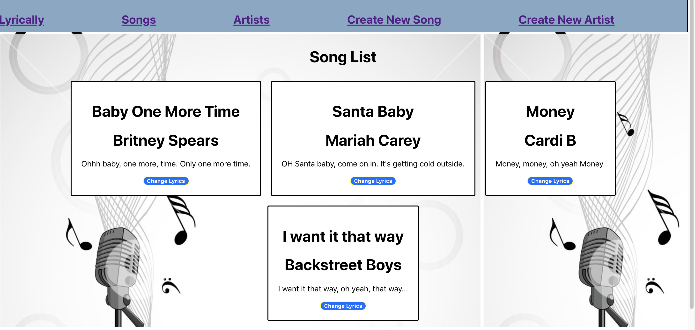

# Lyrically 
- a web application that enable a User to creatively change music lyrics based on the User's input.

## Screenshot

## Website - lyrically.surge.sh

## Technology Used - Front-End

- React
- Axios

## User Stories

- User should be able to view all records of Songs and Artists.

- User should be able to create an individual record of lyrics.

- User should be able to update an existing lyric or Artists.

- User should be able to delete any record of lyric or list of Artists.

## Unsolved Issues

- The ability to improve on React functionality.

- PUT / POST / DELETE function in a way, but it is not intuitively. User must refresh the page or return back to Homepage to view the completed action.

- Ability to properly put in Axios requests.
